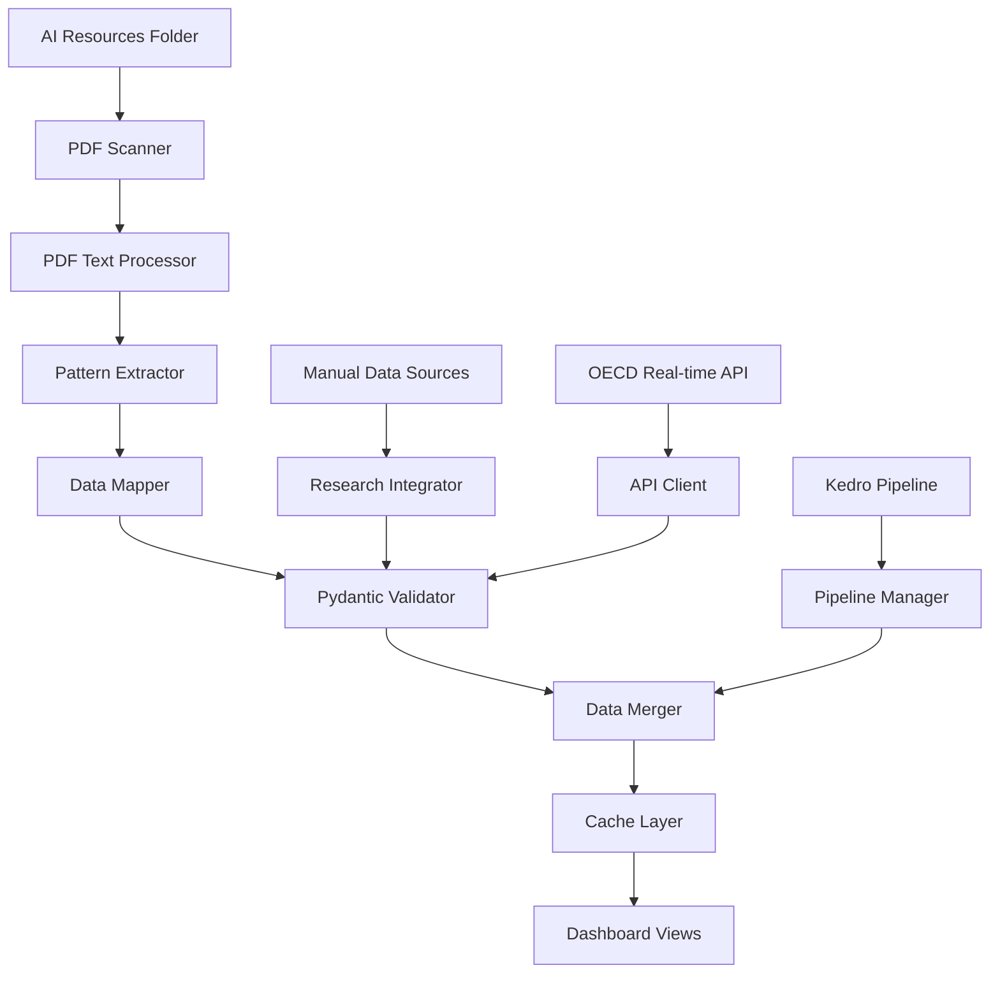

# Data Schema & Pipeline Architecture

## Overview

The AI Adoption Dashboard employs a sophisticated data architecture that combines automated PDF extraction with manual data curation, ensuring both accuracy and comprehensive coverage. This document details the complete data schema, pipeline architecture, and integration patterns.

## 📊 Data Architecture Overview



## 🏗️ Core Components

### 1. Data Loading Pipeline

#### Primary Data Loaders (`data/loaders.py`)
```python
@st.cache_data(ttl=3600)
def load_all_datasets() -> Tuple[Dict[str, pd.DataFrame], Dict[str, Any]]
```

**Responsibilities:**
- Orchestrates data loading from all sources
- Manages caching with 1-hour TTL
- Provides fallback mechanisms
- Validates all loaded data

#### Automated PDF Pipeline (`data/pdf_data_pipeline.py`)
```python
class AutomatedDataIngestionPipeline:
    def run_pipeline() -> Dict[str, pd.DataFrame]
```

**Key Features:**
- Automatic PDF detection and processing
- Text extraction using PyPDF2 and pdfplumber
- Pattern matching for statistics and metrics
- Intelligent data categorization
- Caching with hash-based invalidation

#### Integration Manager (`data/pipeline_integration.py`)
```python
class PipelineIntegrationManager:
    def load_data_with_strategy(dataset_name: str) -> Tuple[pd.DataFrame, Dict[str, Any]]
```

**Strategy Selection:**
- Automated → Manual fallback
- Prerequisite checking
- Real-time status monitoring
- Performance optimization

### 2. Data Validation System

#### Pydantic Models (`data/models.py`)

**Core Models:**
```python
class HistoricalDataPoint(BaseModel):
    year: int = Field(..., ge=2017, le=2025)
    ai_use: float = Field(..., ge=0, le=100)
    genai_use: float = Field(..., ge=0, le=100)
    
    @field_validator('genai_use')
    def genai_cannot_exceed_ai(cls, v, info):
        # Custom validation logic
```

**Validation Hierarchy:**
1. **Field-level validation**: Type checking, range validation
2. **Model-level validation**: Cross-field consistency checks
3. **Dataset-level validation**: Distribution and completeness checks
4. **Pipeline-level validation**: Integration consistency

#### Validation Registry
```python
MODEL_REGISTRY = {
    "historical_data": HistoricalDataPoint,
    "sector_data": SectorData,
    "financial_impact": FinancialImpactData,
    # ... additional models
}
```

### 3. Research Integration Layer

#### Research Data Integrator (`data/research_integration.py`)
```python
class ResearchDataIntegrator:
    def get_authentic_data_collection() -> Dict[str, pd.DataFrame]
```

**Data Source Categories:**

**Phase 1 - Core Research:**
- Stanford AI Index 2025 (A+ credibility)
- McKinsey Global Survey 2024 (A+ credibility)
- Goldman Sachs Research (A+ credibility)
- Richmond Fed Productivity Research (A+ credibility)

**Phase 2A - Government Research:**
- St. Louis Fed Analysis (A+ credibility)
- OECD Policy Observatory (A+ credibility)
- OECD Employment Outlook (A+ credibility)

**Phase 2B - Economic Analysis:**
- Goldman Sachs Global Economics (A+ credibility)
- NBER Working Papers (A+ credibility)
- IMF Working Papers (A+ credibility)
- Economic Research Institute (A credibility)

**Phase 2C - Technical Research:**
- NVIDIA Token Economics (A credibility)
- AI Strategy Framework (B+ credibility)
- Public Sector AI Study (A credibility)

## 📋 Data Schema Specifications

### Historical Trends Data
```python
@dataclass
class HistoricalTrendsSchema:
    year: int                    # 2017-2025
    ai_use: float               # Overall AI adoption %
    genai_use: float           # GenAI adoption %
    data_source: str           # Source attribution
    confidence_level: str      # High/Medium/Low
    sample_size: Optional[int] # Survey sample size
```

**Validation Rules:**
- Year range: 2017-2025
- Percentages: 0-100
- GenAI ≤ AI adoption
- Required: year, ai_use, data_source

### Sector Analysis Data
```python
@dataclass
class SectorDataSchema:
    sector: str                 # Industry sector name
    adoption_rate: float       # Overall adoption %
    genai_adoption: float     # GenAI specific %
    avg_roi: float            # Return on investment
    data_source: str          # Source attribution
    survey_participants: int  # Sample size
    confidence_interval: str  # ±X%
    methodology: str          # Collection method
```

**Validation Rules:**
- Sector names: Standardized list
- Adoption rates: 0-100%
- ROI: 0-20x multiplier
- Required: sector, adoption_rate, data_source

### Financial Impact Data
```python
@dataclass
class FinancialImpactSchema:
    function: str                           # Business function
    companies_reporting_revenue_gains: int  # % reporting gains
    companies_reporting_cost_savings: int   # % reporting savings
    avg_cost_reduction: float              # Average % reduction
    avg_revenue_increase: float            # Average % increase
    data_source: str                       # Source attribution
    sample_size: int                       # Survey participants
    methodology: str                       # Collection method
```

### Investment Trends Data
```python
@dataclass
class InvestmentDataSchema:
    year: int                   # Investment year
    total_investment: float     # Billions USD
    genai_investment: float    # GenAI specific funding
    us_investment: float       # US market share
    china_investment: float    # China market share
    uk_investment: float       # UK market share
    data_source: str           # Source attribution
    methodology: str           # Tracking method
    currency: str              # USD/EUR/etc
```

### Geographic Distribution Data
```python
@dataclass
class GeographicDataSchema:
    location: str               # Country/region name
    adoption_rate: float       # Regional adoption %
    investment_total: float    # Total investment
    research_centers: int      # Number of AI research centers
    policy_score: float        # AI policy readiness (0-100)
    talent_index: float        # AI talent availability
    data_source: str           # Source attribution
    iso_code: str              # Country ISO code
```

### Productivity Research Data
```python
@dataclass
class ProductivityDataSchema:
    industry: str               # Industry sector
    productivity_gain: float   # % productivity increase
    task_category: str         # Type of tasks affected
    implementation_time: int   # Months to implement
    skill_requirement: str     # Low/Medium/High
    confidence_level: str      # Research confidence
    data_source: str           # Source attribution
    study_period: str          # Research timeframe
```

## 🔄 Data Flow Architecture

### 1. Ingestion Layer

```python
# PDF Processing Flow
PDF Files → Text Extraction → Pattern Matching → Data Structures
    ↓              ↓              ↓              ↓
PyPDF2/        Regex/NLP     Statistics/     Pandas
pdfplumber     Analysis      Metrics         DataFrames
```

### 2. Validation Layer

```python
# Validation Pipeline
Raw Data → Field Validation → Model Validation → Dataset Validation
    ↓           ↓                ↓                 ↓
Type/Range   Cross-field      Distribution    Integration
Checking     Consistency      Analysis        Consistency
```

### 3. Integration Layer

```python
# Data Merger Strategy
Automated Data + Manual Data → Conflict Resolution → Merged Dataset
      ↓              ↓              ↓                ↓
  PDF Extract   Research DB    Precedence        Final Data
                              Rules
```

### 4. Serving Layer

```python
# Cache and Serve
Merged Data → Cache Layer → View Components → User Interface
     ↓           ↓             ↓               ↓
Validation   Streamlit     Component        Dashboard
            Cache         Rendering         Views
```

## 🏭 Pipeline Execution Patterns

### Automated Pipeline (Primary)
```python
def automated_execution():
    1. Scan PDF folder for new/updated files
    2. Extract text and tables using dual-library approach
    3. Apply pattern matching for data extraction
    4. Validate extracted data against schemas
    5. Merge with existing manual data
    6. Cache results with TTL
    7. Serve to dashboard components
```

### Manual Pipeline (Fallback)
```python
def manual_execution():
    1. Load curated datasets from research_integration
    2. Apply validation using Pydantic models
    3. Cache validated data
    4. Serve to dashboard components
```

### Hybrid Pipeline (Production)
```python
def hybrid_execution():
    1. Check automation prerequisites
    2. Run automated pipeline for supported datasets
    3. Fall back to manual for unsupported datasets
    4. Merge all datasets with conflict resolution
    5. Validate merged results
    6. Cache and serve
```

## 🎯 Performance Optimization

### Caching Strategy

**Multi-level Caching:**
1. **Function-level**: `@st.cache_data(ttl=3600)`
2. **File-level**: Hash-based PDF processing cache
3. **Dataset-level**: Validated data cache
4. **Component-level**: View-specific caching

**Cache Invalidation:**
- Time-based: 1-hour TTL for data
- Content-based: File hash changes
- Manual: Cache clear commands
- Dependency-based: Source data updates

### Memory Management

**Optimization Techniques:**
- Lazy loading of large datasets
- Chunked processing for PDF extraction
- Memory monitoring and alerts
- Garbage collection optimization

**Memory Allocation:**
```python
# Typical memory usage
Base Application: ~200MB
PDF Processing: ~150MB per PDF
Data Validation: ~100MB
View Rendering: ~200MB
Total Recommended: 4GB+ RAM
```

## 🔐 Data Quality Assurance

### Quality Metrics

**Data Completeness:**
- Required field coverage: 100%
- Optional field coverage: >80%
- Source attribution: 100%
- Validation pass rate: >95%

**Data Accuracy:**
- Cross-source validation: Automated
- Statistical consistency: Automated
- Expert review: Manual quarterly
- User feedback integration: Ongoing

**Data Freshness:**
- PDF monitoring: Real-time
- Manual data updates: Monthly
- Cache refresh: Hourly
- Full revalidation: Daily

### Error Handling

**Graceful Degradation:**
```python
try:
    # Attempt automated extraction
    data = automated_pipeline.extract()
except ExtractionError:
    # Fall back to manual data
    data = manual_pipeline.load()
except ValidationError:
    # Use cached data with warning
    data = cache.get_last_valid()
```

**Error Recovery:**
- Automatic retry with exponential backoff
- Fallback to cached data
- User notification with context
- Admin alerting for critical failures

## 📊 Monitoring & Observability

### Pipeline Metrics

**Performance Metrics:**
- Extract time per PDF: <30 seconds
- Validation time per dataset: <5 seconds
- Total pipeline execution: <2 minutes
- Cache hit rate: >80%

**Quality Metrics:**
- Data extraction success rate: >90%
- Validation pass rate: >95%
- Integration conflict rate: <5%
- User error reports: <1% of views

**Availability Metrics:**
- Pipeline uptime: >99.5%
- Data freshness: <1 hour lag
- Cache availability: >99.9%
- View rendering success: >99%

### Logging Strategy

**Log Levels:**
```python
DEBUG:   Detailed pipeline execution steps
INFO:    Successful operations and metrics
WARNING: Fallback activations and quality issues
ERROR:   Failed operations requiring attention
CRITICAL: System failures requiring immediate action
```

**Log Sources:**
- PDF processing engine
- Data validation system
- Integration pipeline
- Cache management
- User interactions

## 🔮 Future Architecture Considerations

### Scalability Enhancements

**Horizontal Scaling:**
- Distributed PDF processing
- Multi-region data replication
- Load-balanced view serving
- Containerized deployment

**Vertical Scaling:**
- GPU-accelerated text extraction
- Advanced NLP for data extraction
- Machine learning validation
- Predictive caching

### Technology Evolution

**Near-term (6 months):**
- Enhanced ML-based data extraction
- Real-time data validation
- Advanced conflict resolution
- Automated quality scoring

**Medium-term (12 months):**
- Streaming data ingestion
- Advanced analytics engine
- Multi-tenant architecture
- API-first design

**Long-term (24 months):**
- AI-powered data curation
- Federated learning integration
- Blockchain data provenance
- Edge computing deployment

---

This architecture provides a robust foundation for handling diverse data sources while maintaining quality, performance, and scalability. The hybrid approach ensures reliability while enabling innovation through automated extraction capabilities.